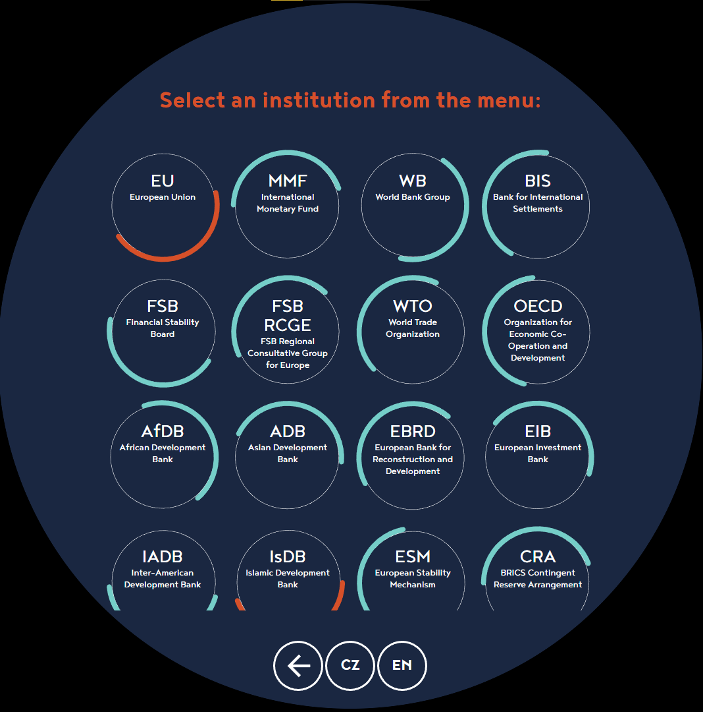

# cnb-earth-webgl-app
A WebGL2.0 web application written in native JS with the help of RequireJS.

The application is implemented using a custom elementary WebGL engine.




## How to run
The application contains several possible external textures that must be loaded for the application to display correctly. These textures must come from the same origin as the web application. This is determined by `CORS` policy. 

There are several ways to run the application.

1. Execute `run_earth.bat`. Requirement: `Google Chrome` and `Windows`. Opens the browser in kiosk mode with web security disabled. This option ensures that the `CORS` policy is not taken into account.
2. For other browsers, the procedure may be slightly different, but it should be possible to disable web security. Similar command for `chrome` could be executed even on `Linux` to open the app in the same state as in 1. option.
3. Host the application on `HTML` server to ensure the same origin for CORS policy. Application loading may be slower due to texture downloads. 

---
## Description
- The main part of the app is a rotating globe showing the currently selected global organisation.

- The globe can be rotated by clicking and holding the left mouse button. In the case of a touch screen, just hold and drag with a finger. Rotation is implemented using a virtual trackball.

- An organisation can be selected from the menu. Each one has its own detail with information that can be displayed by clicking on the info button. The whole application has a Czech and English version. You can switch between these versions in the application menu. Information about these organisations has been prepared by the team at the Czech National Bank in both languages.

- Each country has a defined location on the globe and each organisation has its own list of countries. Each has its own `json` file where the information and list of countries are defined. The file is in the following format:

```json
{
    "shortcut": "ORG",
    "lang":{
        "cz":{
            "name": "Jméno organizace",
            "residence": "Sídlo organizace",
            "residenceDetail": "doplňující informace k sídlu",
            "authorityName": "Název centrálního orgánu",
            "authorityNameDetail" : "doplňující info k centrálníu orgánu",
            "numberOfMembers": "počet členů",
            "numberOfMembersDetail": "doplňují informace o počtu členů",
            "year": "rok vzniku",
            "yearDetail": "doplňující informace k roku vzniku",
            "description": [
                ["paragraf1", "paragraf2"]
            ]
        },
        "en":{
            "name": "Organisation name",
            "residence": "Residence of the organisation",
            "residenceDetail": "additional info to residence",
            "authorityName": "Name of the central authority",
            "authorityNameDetail": "additional info to authority",
            "numberOfMembers": "8",
            "numberOfMembersDetail": "4 out of them are not actually members",
            "year": "founding year",
            "yearDetail" : "additional info to the year",
            "description": [
                ["paragraph1", "paragraph2"]
            ]
        }
    },
    "rotation": [80, 52],
    "members": ["AUT", "BEL", "BGR", "HRV", "CYP", "CZE", "DNK"]
}
```

- Rotation is of the format `[yaw, pitch]` in degrees. These values tell the default globe rotation values for the organization. The application will always rotate the globe back to these values on 30 seconds of inactivity.
- All countries are defined as a three-letter ISO shortcut.

---

## Generator
The generator is a key part of the content editing mechanism for this application.

In order to reflect any changes in the json source files, the `generator.py` script must be run in the `html` folder. A build of this script has been created for `Windows` without the need to install `Python` and the appropriate libraries.

- The generator concatenates all jsons in the `app/data/institutions` folder according to `app/data/group_config.json`. The result is a `groups.json` file in the `Contents` folder.

- Another important function of the generator is the creation of textures for displaying organizations on the globe. If an institution does not have a texture, it will create one. If it does exist, the generator proceeds to include the institution in the resulting json anyway.
- To re-generate the texture, it is necessary to delete the original organisation texture in the `img/groups/` folder and run the script again.

**_IMPORTANT:_** The generator has relatively set paths, it must stay in the html folder.